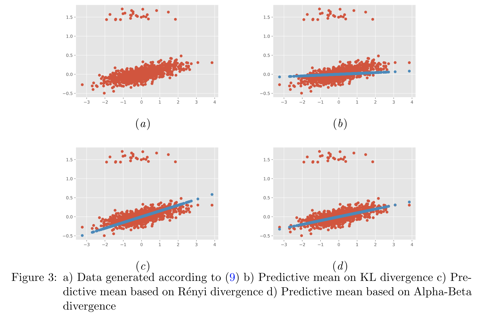

# Alpha-Beta Divergence For Variational Inference
Project for the course Bayesian Methods for Machine Learning at Skoltech

### Project team:

* Hamidreza Behjoo
* Jaspers W. Huanay

### Introduction

> We study here a variational objective to simultaneously trade off effects of mass-covering,spread and outlier robustness.  This is done by developing a variational inference objectiveusing the alpha-beta (AB) divergence, a family of divergence governed by two parametersand covering many of the divergences already used for VI as special cases.

### Main task:

Alpha-Beta divergence is investigated and compared with respect to other wellknown divergences in literature.

### Results:

| alpha, beta   |      MAE      |  MSE |
|----------|:-------------:|------:|
| (1,0, 0.0) (KL) |  0.68 	 | 0.60  |
| (0.3, 0.0) (Renyi) |    0.52   |   0.50  |
| **(2.2,-0.3) (sAB)** | **0.30** |    **0.20** |

For details of the derivation see bml2020_report.pdf
________________________________________________

## Reproducibility:
To get the results showed above, run:

* `bayesian linear regression.ipynb`, for data wihtout modification
* `bayesian linear regression_outlier.ipynb`, for data wiht outliers added

`ABdivergence..*.ipynb` notebooks are work in progress
_________________________________________________

#### References:

- Regli, Jean-Baptiste, and Ricardo Silva. "Alpha-beta divergence for variational inference." arXiv preprint arXiv:1805.01045 (2018).